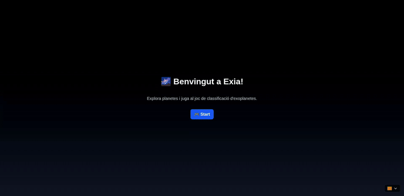

# NASA 2025 Exoplanet Application - Exia

## Project Description

Our project tackles the challenge “A World Away: Hunting for Exoplanets with AI” by combining artificial intelligence and 3D simulation to make exoplanet discovery understandable and engaging. Users can modify physical parameters—such as mass, temperature, and atmospheric density—to generate potential planets. An AI model evaluates these inputs to determine whether the result qualifies as an exoplanet and identifies its type (for example, Super Earth, Gas Giant, or Ice World). The visualization engine then renders the planet in real time, simulating surface textures and atmospheric effects that change dynamically with temperature and composition—hotter planets appear redder, colder ones take on bluish tones. This approach turns abstract scientific data into an interactive visual experience, helping users explore the relationship between planetary physics, AI classification, and astronomy.

---

## Demo



---

## How to Use

This comprehensive guide will walk you through setting up and using the NASA 2025 Exoplanet Application (Exia). The application consists of a FastAPI backend for machine learning predictions and a Next.js frontend with 3D visualization capabilities.

### Prerequisites

Before starting, ensure you have the following installed:

- **Docker and Docker Compose** (recommended method)
- **Node.js 18+** and **npm** (for local development)
- **Python 3.8+** and **pip** (for local development)
- At least **4GB of available RAM**
- Ports **3000** and **8000** available on your system

### Quick Start with Docker (Recommended)

The easiest way to run the application is using Docker:

#### Option 1: Using the Startup Script

```bash
# Make the script executable (if not already)
chmod +x start_docker.sh

# Run the application
./start_docker.sh
```

#### Option 2: Manual Docker Compose

```bash
# Build and start all services
docker-compose up --build

# Or run in detached mode (background)
docker-compose up --build -d
```

#### Access the Application

Once the containers are running, you can access:

- **Frontend Application**: http://localhost:3000
- **Backend API**: http://localhost:8000
- **API Documentation**: http://localhost:8000/docs
- **Health Check**: http://localhost:8000/health

### Local Development Setup

If you prefer to run the application locally without Docker:

#### Backend Setup

1. **Navigate to the Backend directory:**
   ```bash
   cd Backend
   ```

2. **Install Python dependencies:**
   ```bash
   pip install -r requirements.txt
   ```

3. **Ensure model files are present:**
   The following files should be in the `Backend/modelos/` directory:
   - `clf_exoplanet_type.joblib` (required) - Type classifier model
   - `clf_is_exoplanet.joblib` (optional) - Binary exoplanet classifier
   - `metadata.joblib` (required) - Model metadata

4. **Start the backend server:**
   ```bash
   python start_server.py
   ```
   
   The API will be available at `http://localhost:8000`

#### Frontend Setup

1. **Navigate to the Frontend directory:**
   ```bash
   cd Frontend
   ```

2. **Install Node.js dependencies:**
   ```bash
   npm install
   ```

3. **Start the development server:**
   ```bash
   npm run dev
   ```
   
   The application will be available at `http://localhost:3000`

### Using the Application

#### Main Features

1. **3D Space Visualization**
   - Interactive 3D scene with celestial bodies
   - Navigate through space using mouse controls
   - View different planets and exoplanets in 3D

2. **Exoplanet Classification Game**
   - Access the game at `/play` route
   - Input exoplanet parameters (radius, temperature, orbital period, etc.)
   - Get real-time predictions using machine learning models
   - View classification results with confidence scores

3. **Multi-language Support**
   - Available languages: English, Spanish, Catalan, Galician
   - Language switcher in the navigation
   - All interface elements are translated

4. **QR Code Access**
   - Generate QR codes for easy mobile access at `/qr`
   - Share the application with others

#### API Usage

The backend provides several endpoints for exoplanet prediction:

**Predict Exoplanet Type:**
```bash
curl -X POST "http://localhost:8000/predict" \
     -H "Content-Type: application/json" \
     -d '{
       "koi_prad": 11.2,
       "koi_teq": 1400,
       "koi_period": 3.5,
       "koi_model_snr": 12.0,
       "koi_steff": 5600.0,
       "koi_srad": 1.0
     }'
```

**Alternative Classification Endpoint:**
```bash
curl -X POST "http://localhost:8000/classify-exoplanet" \
     -H "Content-Type: application/json" \
     -d '{
       "koi_prad": 11.2,
       "koi_teq": 1400,
       "koi_period": 3.5,
       "koi_model_snr": 12.0,
       "koi_steff": 5600.0,
       "koi_srad": 1.0
     }'
```

### Docker Management Commands

#### Viewing Logs
```bash
# View all service logs
docker-compose logs -f

# View specific service logs
docker-compose logs -f frontend
docker-compose logs -f backend
```

#### Managing Services
```bash
# Stop all services
docker-compose down

# Stop and remove volumes
docker-compose down -v

# Rebuild and restart
docker-compose up --build --force-recreate

# Check service status
docker-compose ps
```

### Troubleshooting

#### Port Conflicts
If you encounter port conflicts, modify the ports in `docker-compose.yml`:
```yaml
ports:
  - "3001:3000"  # Frontend on port 3001
  - "8001:8000"  # Backend on port 8001
```

#### Services Not Starting
1. Check if Docker is running: `docker info`
2. Check logs: `docker-compose logs`
3. Ensure model files exist in `Backend/modelos/`
4. Try rebuilding: `docker-compose up --build --force-recreate`

#### Frontend Can't Connect to Backend
1. Verify CORS configuration in `Backend/main.py`
2. Check if both services are on the same network: `docker network ls`
3. Test backend directly: `curl http://localhost:8000/health`

#### Model Loading Issues
1. Ensure all required model files are present in `Backend/modelos/`
2. Check file permissions
3. Verify the model files are not corrupted
4. Check the health endpoint: `curl http://localhost:8000/health`

### Development Workflow

#### Testing the API
```bash
# Test the health endpoint
curl http://localhost:8000/health

# Test the API with sample data
curl -X POST "http://localhost:8000/predict" \
     -H "Content-Type: application/json" \
     -d '{"koi_prad": 11.2, "koi_teq": 1400}'
```

### Project Structure

```
NASA2025/
├── Backend/                 # FastAPI backend
│   ├── main.py             # Main API application
│   ├── start_server.py     # Server startup script
│   ├── requirements.txt    # Python dependencies
│   ├── modelos/           # Machine learning models
│   └── Dockerfile         # Backend container config
├── Frontend/               # Next.js frontend
│   ├── src/app/           # Application pages and components
│   ├── package.json       # Node.js dependencies
│   └── Dockerfile         # Frontend container config
├── docker-compose.yml      # Multi-service orchestration
└── start_docker.sh        # Quick start script
```

### Support

If you encounter any issues:

1. Check the troubleshooting section above
2. Review the Docker logs: `docker-compose logs`
3. Verify all prerequisites are met
4. Ensure ports 3000 and 8000 are available
5. Check that model files are properly placed in `Backend/modelos/`

For additional help, refer to the individual README files in the `Backend/` and `Frontend/` directories.
